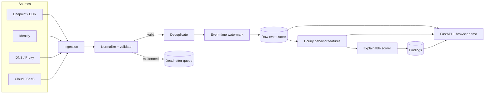
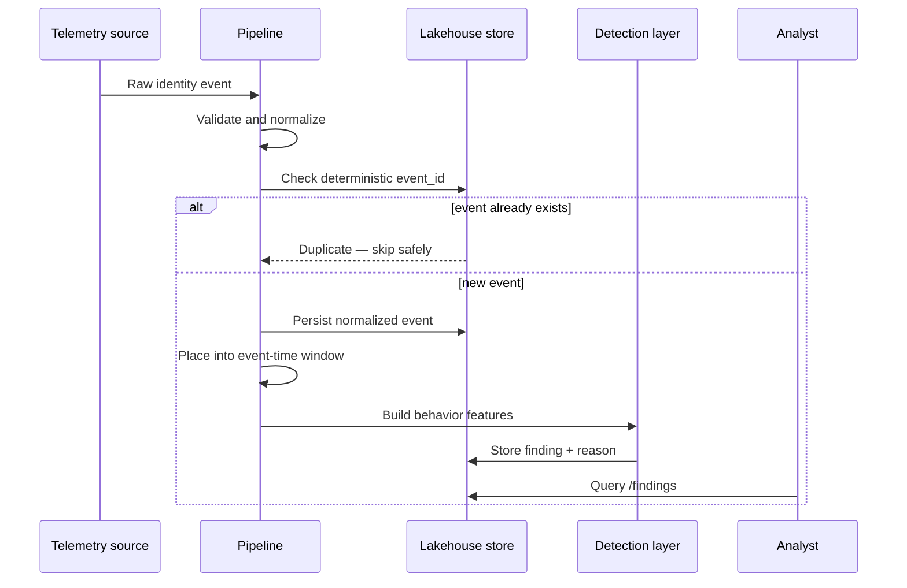
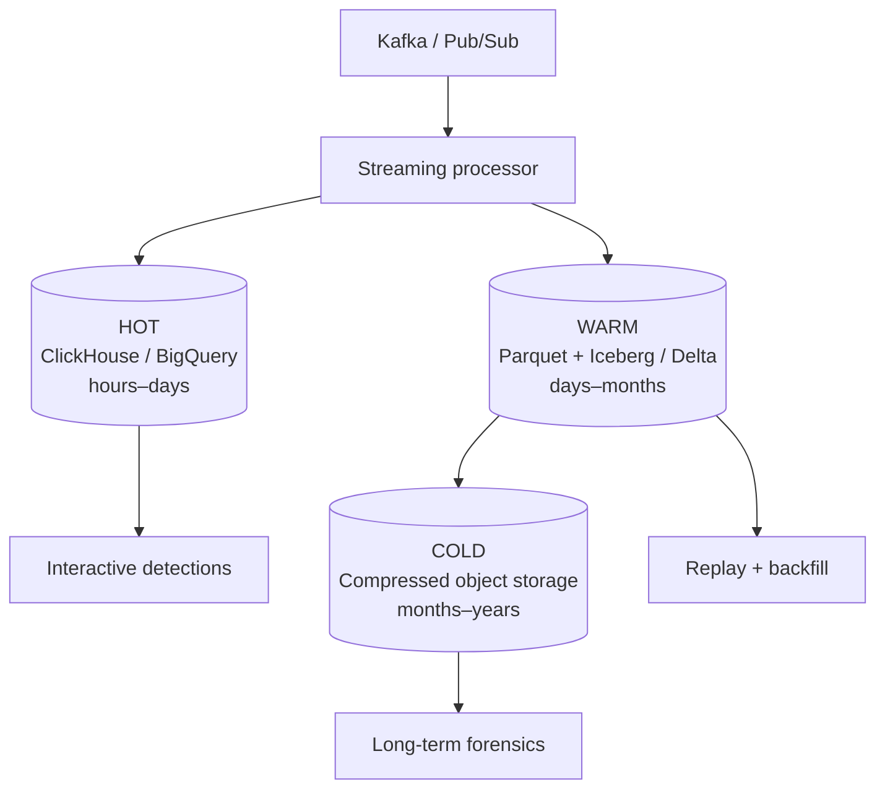

<div align="center">

# Security Telemetry Lakehouse

### From noisy security events to explainable, detection-ready signals

[](https://www.python.org/)
[](https://fastapi.tiangolo.com/)
[](Dockerfile)
[](LICENSE)
[](#safety)

**Normalize · deduplicate · watermark · aggregate · detect**

[Quick start](#quick-start) · [Live API walkthrough](#api-walkthrough) · [Architecture](#architecture) · [Scale-out design](#scaling-beyond-the-local-demo)

</div>

---

A defensive reference implementation of a security telemetry pipeline. It turns synthetic endpoint, identity, DNS, cloud, and SaaS events into a canonical schema, hourly behavioral features, and explainable findings.

The complete demo runs locally with **Python + SQLite** and requires no cloud account. The same data contracts can be carried into Kafka, Flink or Spark, object storage, ClickHouse, or BigQuery.

## 60-second reviewer path

Short on time? Review the project in this order:

1. [Understand the telemetry problem](#why-this-project).
2. [Follow one event through the architecture](#architecture).
3. [Inspect the implemented pipeline](#what-is-included).
4. [Review the analyst API workflow](#api-walkthrough).
5. [Run the deterministic demo](#quick-start).

## Why this project?

At security-platform scale, ingestion is only the beginning. Events arrive twice, arrive late, use different schemas, and create expensive state. This project makes those engineering trade-offs visible and testable.

| Challenge | What this project demonstrates |
| --- | --- |
| Inconsistent source schemas | One validated `SecurityEvent` contract |
| Duplicate delivery | Deterministic IDs and idempotent inserts |
| Offline or delayed sources | Separate event/ingest time and an explicit lateness watermark |
| High-volume raw telemetry | Partition-aware storage and tiering guidance |
| Noisy individual events | Hourly principal-level feature windows |
| Black-box alerts | Transparent scoring with human-readable reasons |

## Architecture



### One event's journey



## What is included

- Canonical Pydantic event models
- Deterministic synthetic telemetry generator
- Normalization, validation, and dead-letter handling
- Deduplication and late-event accounting
- SQLite-backed local event and finding storage
- Hourly features for identities and devices
- Explainable baseline detection scoring
- FastAPI endpoints and a zero-build browser demo
- Unit tests, Dockerfile, and production design notes

## Quick start

### 1. Install

```bash
git clone https://github.com/VinayK88/Security-Telemetry-Lakehouse.git
cd Security-Telemetry-Lakehouse

python -m venv .venv
source .venv/bin/activate        # Windows: .venv\Scripts\activate
pip install -r requirements.txt
```

### 2. Run the deterministic CLI demo

```bash
python scripts/run_demo.py --events 10000 --seed 42
```

The command creates `data/demo-lakehouse.db`, prints pipeline metrics, and shows the ten highest-risk findings.

### 3. Start the API and UI

```bash
uvicorn app.main:app --reload
```

| Destination | URL |
| --- | --- |
| Browser demo | <http://localhost:8000> |
| Interactive OpenAPI docs | <http://localhost:8000/docs> |
| Raw OpenAPI schema | <http://localhost:8000/openapi.json> |

### Docker alternative

```bash
docker build -t security-telemetry-lakehouse .
docker run --rm -p 8000:8000 security-telemetry-lakehouse
```

## API walkthrough

With the server running, generate and ingest 1,000 deterministic events:

```bash
curl -sS -X POST http://localhost:8000/demo/ingest \
  -H 'Content-Type: application/json' \
  -d '{"events": 1000, "seed": 42}' | python -m json.tool
```

The response is a cumulative pipeline scorecard:

| Field | Meaning |
| --- | --- |
| `received` | Events presented to this API process |
| `accepted` | New normalized events written to SQLite |
| `duplicates` | Events skipped because the deterministic ID already exists |
| `late_events` | Events older than the 30-minute watermark |
| `dead_letter` | Records that failed normalization or validation |
| `findings` | Findings produced by the latest analytics refresh |

> Counts can differ when the API has already ingested data because the in-process metrics and SQLite store retain state.

Inspect the results:

```bash
# Pipeline health
curl -sS http://localhost:8000/metrics | python -m json.tool

# Highest-risk findings
curl -sS 'http://localhost:8000/findings?limit=5' | python -m json.tool

# Recent feature windows and normalized events
curl -sS 'http://localhost:8000/features?limit=5' | python -m json.tool
curl -sS 'http://localhost:8000/events?limit=5' | python -m json.tool

# Malformed records and their validation errors
curl -sS 'http://localhost:8000/dead-letter?limit=5' | python -m json.tool
```

## Data examples

### Normalized event

```json
{
  "event_id": "93bde8...",
  "event_time": "2026-08-10T10:21:31+00:00",
  "ingest_time": "2026-08-10T10:21:34+00:00",
  "source": "entra",
  "event_type": "authentication",
  "principal": "finance.user@example.com",
  "device_id": "mac-fin-014",
  "src_ip": "203.0.113.24",
  "action": "login",
  "outcome": "failure",
  "risk": 0.74,
  "attributes": {}
}
```

### Derived feature window

```json
{
  "principal": "finance.user@example.com",
  "window_start": "2026-08-10T10:00:00+00:00",
  "event_count": 18,
  "failed_logins": 11,
  "distinct_ips": 7,
  "sensitive_actions": 2,
  "average_risk": 0.61
}
```

### Explainable finding

```json
{
  "principal": "finance.user@example.com",
  "finding_type": "unusual_identity_behavior",
  "score": 0.9415,
  "reason": "11 failed events; 7 distinct source IPs; 2 sensitive actions; average event risk 0.61",
  "window_start": "2026-08-10T10:00:00+00:00"
}
```

The baseline score is intentionally easy to audit:

| Signal | Weight | Saturates at |
| --- | ---: | ---: |
| Failed events | 35% | 10 events |
| Distinct source IPs beyond the first | 25% | 6 IPs |
| Sensitive actions | 25% | 2 actions |
| Average source-event risk | 15% | 1.0 |

A feature window becomes a finding when its combined score is **at least 0.35**. Production systems should learn per-tenant or per-entity baselines and calibrate thresholds with labeled outcomes.

## Correctness behaviors to try

These behaviors are covered by the tests and are useful when exploring the code:

1. Send the same `event_id` twice — the second event increments `duplicates`.
2. Send an event older than the allowed watermark — it increments `late_events` but remains queryable.
3. Omit required event fields — the record is routed to the in-memory dead-letter collection.
4. Generate repeated failed logins across several IPs — an explainable identity finding is produced.

Run the test suite:

```bash
python -m unittest discover -s tests -v
```

## Repository map

```text
.
├── app/
│   ├── main.py          # FastAPI routes and browser demo
│   ├── models.py        # Event, feature, metric, and finding contracts
│   ├── normalize.py     # Source normalization and deterministic IDs
│   ├── pipeline.py      # Validation, deduplication, watermarking
│   ├── storage.py       # SQLite-backed local lakehouse
│   ├── features.py      # Hourly behavioral aggregation
│   ├── detection.py     # Transparent baseline scoring
│   └── generator.py     # Deterministic synthetic telemetry
├── scripts/run_demo.py
├── tests/
├── docs/production-architecture.md
├── Dockerfile
└── requirements.txt
```

## Scaling beyond the local demo

The local components are deliberately small; the contracts are designed to map to distributed equivalents.

| Local component | Production option | Contract that stays the same |
| --- | --- | --- |
| Python event generator | EDR, IdP, DNS, cloud, and SaaS collectors | Canonical event fields |
| In-process pipeline | Flink, Spark Structured Streaming, Dataflow | Normalize → deduplicate → watermark |
| SQLite | ClickHouse, BigQuery, Elasticsearch | Queryable hot data |
| Local rows | Parquet + Iceberg or Delta | Replayable raw history |
| Python feature builder | Stateful stream processor / feature service | Windowed entity features |
| FastAPI | Horizontally scaled service | Analyst-facing query contract |



Key production principles:

- Prefer at-least-once delivery plus deterministic IDs and idempotent sinks.
- Retain immutable raw events separately from enriched and aggregated data.
- Partition with tenant/source/time-aware routing keys; monitor hot partitions.
- Bound state with watermarks, TTLs, and checkpointing.
- Compact small files asynchronously and avoid indexing every field.
- Track lag, timestamp skew, null rates, schema drift, and cost per million events.

See [Production Architecture](docs/production-architecture.md) for the extended design notes.

## Roadmap

- Kafka or Pub/Sub ingestion adapter
- Spark Structured Streaming implementation
- Iceberg, Delta, or BigQuery sink
- OCSF-compatible schema adapter and schema registry
- Tenant isolation and entity resolution
- ATT&CK enrichment and streaming feature store
- OpenTelemetry metrics, replay orchestration, and data-quality SLAs

## Safety

This repository is for defensive engineering and uses synthetic telemetry. It does not exploit systems or provide offensive capabilities. See [SECURITY.md](SECURITY.md).

## Contributing

Contributions are welcome. Please read [CONTRIBUTING.md](CONTRIBUTING.md), keep example data synthetic, and run the tests before opening a pull request.

## License

Distributed under the [MIT License](LICENSE).
